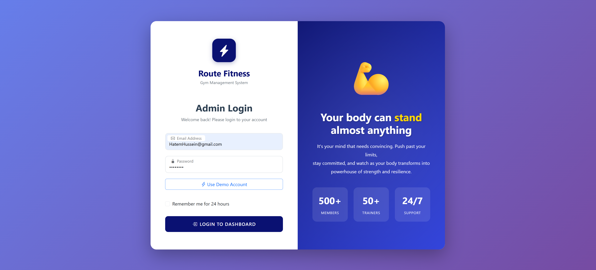
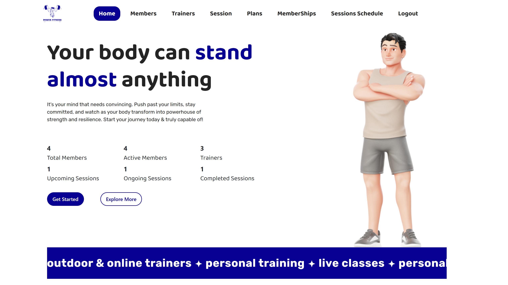
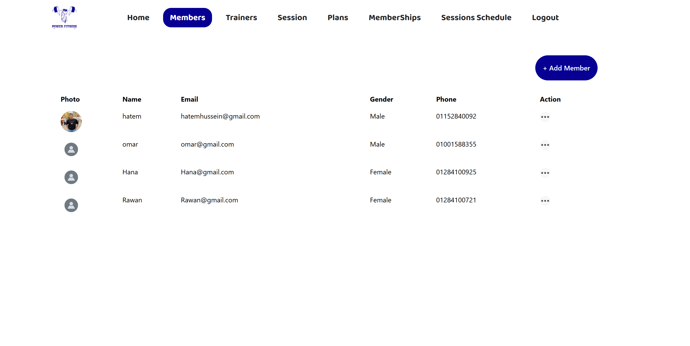
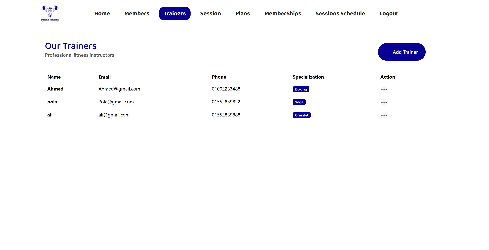
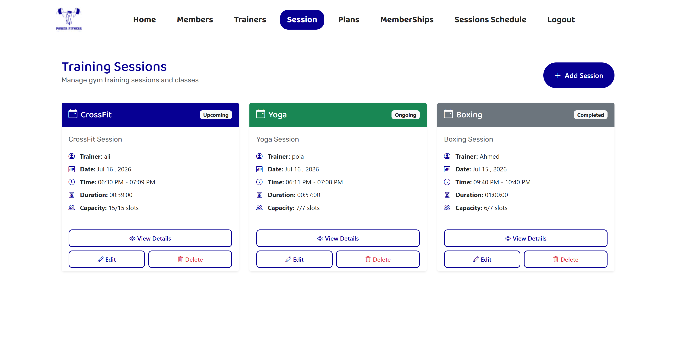
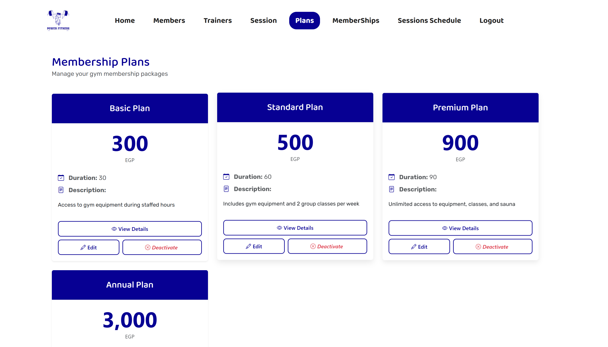

# 🏋️ Route Fitness - Gym Management System

A full-featured Gym Management System built using ASP.NET Core MVC (.NET 9) following the N-Tier Architecture.

## 🚀 Live Demo

https://routefitness.runasp.net

### Demo Account

**Email:** hatemhussein@gmail.com

**Password:** P@ssw0rd

---

## ✨ Features

- Authentication & Authorization (ASP.NET Identity)
- Role-Based Access Control
- Member Management
- Trainer Management
- Membership Management
- Training Sessions
- Session Booking
- Analytics Dashboard
- File Upload
- Responsive UI
- Repository Pattern
- Unit of Work Pattern
- AutoMapper
- Entity Framework Core
- SQL Server

---

## 🛠️ Technologies

- ASP.NET Core MVC (.NET 9)
- Entity Framework Core
- SQL Server
- ASP.NET Identity
- AutoMapper
- Bootstrap 5
- HTML5
- CSS3
- JavaScript
- LINQ

---

## 📸 Screenshots

### Login



### Analytics



### Members



### Trainers



### Sessions



### Plans




---

## 🏗️ Architecture

- Presentation Layer (PL)
- Business Logic Layer (BLL)
- Data Access Layer (DAL)
- Repository Pattern
- Unit of Work
- Dependency Injection

---

## 📦 Installation

```bash
git clone https://github.com/hatem32/GymManagementSystem.git
```

Update your connection string inside:

```
appsettings.Development.json
```

Run:

```bash
Update-Database
```

or

```bash
dotnet ef database update
```

Run the project.

---

## 👨‍💻 Author

**Hatem Hussein**
